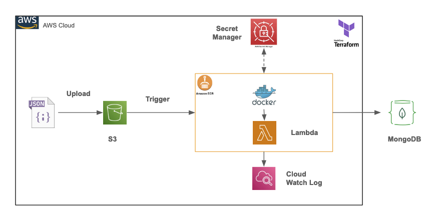

## Deploy Python Lambda functions with container images with Terraform

Reference: https://docs.aws.amazon.com/lambda/latest/dg/python-image.html#python-image-clients


## Architecture Overview

This architecture leverages AWS services to create a serverless data processing workflow for handling JSON files. Below is a detailed explanation of each component and its role:



- AWS S3:

    Stores uploaded JSON files, triggering the data processing workflow.

- AWS Lambda:

    Processes JSON data upon S3 upload events.
    
    Utilizes Docker containers from Amazon ECR for execution.

- Amazon ECR:

    Hosts Docker images used by Lambda functions for containerized operations.

- AWS Secrets Manager:
    
    Securely manages sensitive information like database credentials.

- MongoDB:
    
    Serves as the database for storing processed data from Lambda functions.

- CloudWatch Logs:
    
    Captures logs from Lambda functions for monitoring and troubleshooting purposes.

- Terraform:
    
    Facilitates infrastructure as code to manage and deploy AWS resources efficiently.


## Build Lambda


#### The command to build lambda image
```shell
docker build --platform linux/arm64 -t lambda_event_trigger_toturial:latest -f ./lambda/Dockerfile ./lambda
```
or

```shell
cd lambda && 
docker build --platform linux/arm64 -t lambda_event_trigger_toturial:latest .
```

#### The command to run lambda

.env.docker
```shell
ENV=dev
AWS_DEFAULT_REGION=ap-southeast-1
AWS_ACCESS_KEY_ID=
AWS_SECRET_ACCESS_KEY=
```


```shell
docker run --platform linux/arm64 --env-file .env.docker -p 9000:8080 -it lambda_event_trigger_toturial:latest
```

#### Test Lambda

```shell
curl "http://localhost:9000/2015-03-31/functions/function/invocations" -d '{"payload":"hello world!"}'

curl "http://localhost:9000/2015-03-31/functions/function/invocations" -d "@example_event_record.json" -H "Content-Type: application/json"

```

### Deploy Lambda


.env.local
```shell
export AWS_DEFAULT_REGION=ap-southeast-1
export AWS_ACCESS_KEY_ID=
export AWS_SECRET_ACCESS_KEY=
```

```shell
source .env.local
``` 

#### Push AWS ECR

```shell
account_id=932682266260
region=ap-southeast-1
image_name=lambda_event_trigger_toturial
repo_name=${image_name}
aws ecr get-login-password --region ${region} | docker login --username AWS --password-stdin ${account_id}.dkr.ecr.${region}.amazonaws.com
```

```shell
docker tag ${image_name}:latest ${account_id}.dkr.ecr.${region}.amazonaws.com/${image_name}:latest
docker push ${account_id}.dkr.ecr.ap-southeast-1.amazonaws.com/${image_name}:latest
```


### Deploy Infrastructure

```shell
terraform init
```

```shell
terraform apply
```

